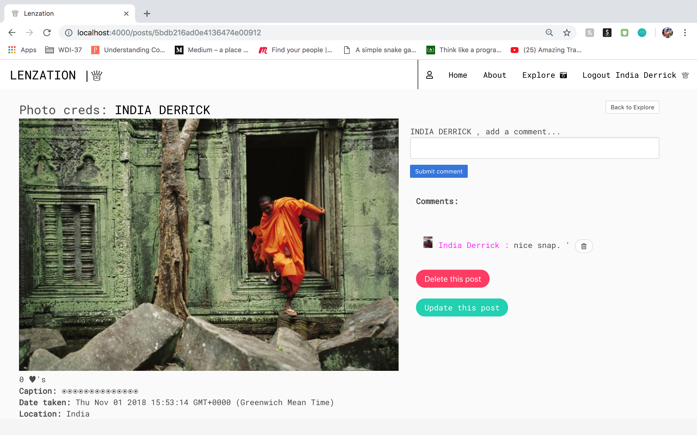

# Instagram Clone ("Lenzation")

View Lenzation on [Heroku](https://offtherail.herokuapp.com/)

View Lenzation's [GitHub Repo](https://github.com/indiaderrick/wdi-project-two)

 We were given 6 days and the choice to make a restaurant review site, a blog or an instagram clone. I chose to do an instagram clone, Lenzation. In my approach, I was trying to replicate the functionality over the look of instagram. As this was my first real web-app, I had an itch to play around with the styling myself rather than replicating an already beautifully designed app.


## Homepage

<p align="center">
  
</p>

## Register

<p align="center">
  
</p>

## Explore

<p align="center">
  
</p>

## Profile


<p align="center">
  
</p>

## Show

<p align="center">
  
</p>


## Technologies Used

* CSS3

* JavaScript (ECMAScript 6)

* Git

* GitHub

* Google Fonts

* EJS

* mongoose

* express

## The Process

I planned to treat this project as a huge learning opportunity rather than a race to get things done in time. Hence, I made sure that I understood everything I was doing and did not move on until I had a solid foundation at each stage. As planned, I did the basic styling throughout the development process and added the extra bits at the end. By the end of the week I was really starting to get to grips of how to manipulate the data I has, and there was lots more that I wanted to add by this stage - especially with followers/following.

## Featured Piece of Code

A piece of code that was a win for me was the section that only allowed users to follow others once. Although for this project I did not have time to add an 'unfollow' functionality, the section of code below meant that the follow button was hidden if the currently logged in user already follows the user of whoever's profile they are on.

```[javascript]
  <% if(locals.isLoggedIn) { %>
    <% if(locals.currentUser.username !== username && !followers.filter(id => id.toString() === locals.currentUser._id.toString()).length) { %>
      <form style="display: inline-block" action='/user/<%= _id %>/follow/<%= locals.currentUser._id %>' method='POST'>
        <button class="button is-rounded">Follow</button>
      </form>
      <% } %>
      <%  } %>
}
```

## Styling

I used two Google Fonts:  

## Wins and Blockers

NOTES:

## Future Features

There are lots of things that I could imagine adding to this project, but at the top of my list would be:

  - Adding an 'Unfollow' button.

  - I would like to add a newsfeed page which lists your own posts and the posts of  people that you follow in chronological order, with the most recent at the top (contrary to the explore page which shows all posts by all users).

  - Since I was focusing on functionality, I didn't get to spend as much time on the styling or UX considerations as I would have liked too. In future, I would like to improve upon the design and introduce a more unique colour scheme.
